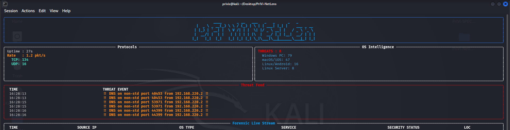

<div align="center">

# 🛡️ PriVi Network Recon Scanner v1.0: Developed by PriViSecurity



</div>

### Full-Spectrum Domain Reconnaissance Suite
**Developed by Prince Ubebe | [PriViSecurity](https://github.com/Privis40)**

---

## ⚠️ Legal Notice

> **This tool is intended ONLY for use against domains and targets you own or have explicit written authorization to assess.**
> Unauthorized reconnaissance against systems you do not own is illegal under the Computer Misuse Act, the CFAA (Computer Fraud and Abuse Act), and equivalent cybercrime laws worldwide.
> **PriViSecurity accepts no liability for unauthorized or malicious use of this tool.**

If you are conducting a professional engagement, ensure you hold a signed **Letter of Authorization (LoA)** from the domain owner before running this tool.

---

## What It Does

PriVi Network Recon Scanner is a full-spectrum domain reconnaissance tool built for penetration testers and security analysts. It automates the initial footprinting phase of an authorized assessment — pulling WHOIS intelligence, DNS records, WAF detection, email scraping, and Nmap vulnerability scanning into a single workflow with a branded PDF report.

It is designed for:
- Penetration testers during the reconnaissance phase of authorized engagements
- Bug bounty researchers conducting initial domain footprinting
- Security teams auditing their own external exposure
- Students and researchers in lab environments

---

## Features

| Feature | Description |
|---|---|
| 🏢 WHOIS & Org Intelligence | Registrar, organization, creation date, geo-IP lookup |
| 🛡️ WAF Detection | Fingerprints Cloudflare, Sucuri, Imperva, Akamai, F5, FortiWeb via response headers |
| 🌐 DNS Enumeration | A, AAAA, MX, NS, TXT, SOA record extraction |
| 📧 Email Intelligence | Scrapes target homepage for exposed email addresses |
| 🔍 Nmap Stealth Vuln Scan | Evasion-mode scan with decoys, fragmentation, vuln scripts |
| 📋 Branded PDF Report | Full findings exported to a PriViSecurity-styled PDF |
| 🔒 Authorization Gate | Mandatory acknowledgment before any scan begins |
| ✅ Rich Terminal UI | Phase-by-phase progress with Rich tables and results display |

---

## Requirements

```bash
pip install python-nmap python-whois dnspython requests rich fpdf2 urllib3
```

Nmap must also be installed on the system:

```bash
# Debian/Ubuntu
sudo apt install nmap

# RHEL/CentOS
sudo yum install nmap
```

---

## Installation

```bash
git clone https://github.com/Privis40/PRIVI_Network_Recon.git
cd PRIVI_Network_Recon
pip install -r requirements.txt
```

---

## Usage

```bash
# Interactive mode
sudo python3 priviscanner.py

# Pass target directly
sudo python3 priviscanner.py example.com
```

The tool will:
1. Display the legal authorization gate — type `AGREE` to confirm
2. Accept a target domain (interactive or CLI argument)
3. Run 5 phases automatically with a spinner per phase
4. Display all findings in Rich tables
5. Save a branded PDF report

### Example Session

```
Target locked: example.com

Phase 1/5  —  WHOIS & Organization Intelligence
  ✔ IP: 93.184.216.34  |  Org: EDGECAST

Phase 2/5  —  WAF & Perimeter Detection
  ✔ WAF: Detected — Cloudflare (cf-ray: 8a3b...)

Phase 3/5  —  DNS Record Enumeration
  ✔ 6 record(s) retrieved

Phase 4/5  —  Email Intelligence Scraping
  ✔ 3 email address(es) found

Phase 5/5  —  Nmap Stealth Vulnerability Scan
  ✔ 7 port(s) scanned  |  2 finding(s)

[+] Report saved: PriVi_Recon_example_com_20260511_143022.pdf
```

---

## Scan Phases

**Phase 1 — WHOIS & Geo**
Resolves the target to an IP, performs WHOIS lookup for org/registrar info, and geo-locates the IP via ip-api.com.

**Phase 2 — WAF Detection**
Makes an HTTPS request to the target and inspects response headers for WAF signatures (cf-ray, x-sucuri-id, etc.) and server fingerprints.

**Phase 3 — DNS Enumeration**
Resolves A, AAAA, MX, NS, TXT, and SOA records for the target domain.

**Phase 4 — Email Scraping**
Fetches the target homepage and extracts email addresses via regex with false-positive filtering.

**Phase 5 — Nmap Stealth Scan**
Runs an Nmap scan with evasion arguments (`-f -D RND:5 --data-length 20`) and the `vuln` script suite against common ports.

---

## PDF Report Sections

1. Target & Organization Intelligence
2. DNS Infrastructure
3. Email Intelligence (Scraped)
4. Port Scan Results
5. Vulnerability Findings
6. Legal & Scope Declaration

---

## What This Tool Does NOT Do

- ❌ Does **not** exploit any vulnerability automatically
- ❌ Does **not** attempt authentication against any service
- ❌ Does **not** brute-force or fuzz any target
- ❌ Does **not** transmit captured data to external servers

---

## Tested On

- Kali Linux 2024+
- Ubuntu 22.04 / 24.04
- Python 3.10+

---

## Author & Brand

**Prince Ubebe**
Cybersecurity Analyst | Security Automation Engineer | Founder, PriViSecurity

- GitHub: [github.com/Privis40](https://github.com/Privis40)
- LinkedIn: [linkedin.com/in/prince-ubebe-291573321](https://www.linkedin.com/in/prince-ubebe-291573321)
- YouTube: [@princeubebecyber](https://youtube.com/@princeubebecyber)
- HackerOne / Bugcrowd: Active researcher

---

## License

This tool is released for **authorized security research and professional use only.**
Redistribution or modification for malicious purposes is strictly prohibited.

© 2026 PriViSecurity. All rights reserved.
